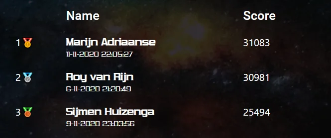

# Freelancer Challenge: Sijmen's Solution

The [challenge](challenge.pdf) [[source](http://freelancerleaderboard.s3-website-eu-west-1.amazonaws.com/)] is as follows:

> The destruction of Freeport 7 left you with almost nothing. The only thing you managed to save was your
  ship (with a bit of ore, water and engine parts stored in the cargo hold) and a star map.
  You decide to head to you home planet in the Codestar system and rebuild, trading at each planet you find
  along the way, so you have plenty of money when you arrive.

Sound easy enough? Well.. It wasn't for me. For 3 days straight I've been on this. Somehow it got me at third place.

The code on this branch is the latest greatest. 
I don't really understand how this configuration get's me the best monez.. but it does.
There were many iterations:

* A long long time ago, when the challenge was still beatable by mortals I created [this beast](https://github.com/SijmenHuizenga/freelancer-challenge/blob/3502b1a859a0de6680f881c768b4597863db5eac/sijmen.py). It ain't pretty, was quite slow but it got me to the third place. (30s) 
* The organizers felt it wasn't nice that 3 people solved it within 12 hours after launch. So they released an update.... this is where hell broke loose.
* I started improving 'te beast', resulting in this much faster [knapsack thing](https://github.com/SijmenHuizenga/freelancer-challenge/blob/362cb8a0a8ada53954ca988387966144752864c2/sijmen.py). It still feels like magic and felt supersonic (0.3s). 
* After inspecting the new challenge a bit I realized: Python ain't gonna cut it. Sooo introducing SPEEEED in the [first GoLang version](https://github.com/SijmenHuizenga/freelancer-challenge/tree/2e1d8b40d81b1b0bf8bc55edd8f6fc82a2a1bb2d). It does the same, but much faster (0.01s).
* Jumps. 'Jumps are the future' i thought. Oh I was green. [Look at this mess.](https://github.com/SijmenHuizenga/freelancer-challenge/tree/2d28cbae9772049003a87381915cd0e8f4aee02f). 
* It turned out, after struggling for many hours, that I forgot a very important rule: `The last planet in the star map is your destination.`. Well shoot. Now I could revert [the deals algorithm](https://github.com/SijmenHuizenga/freelancer-challenge/tree/f7c5159ffa371a1fd1c5d849269178ef24bbae5c), [the unknown algorithm](https://github.com/SijmenHuizenga/freelancer-challenge/tree/4e9e39db8e78184bc5648d8ce20b3b1c64ac56d6) and [the 'smart' algorithm](https://github.com/SijmenHuizenga/freelancer-challenge/tree/90b6ba674f64e6bf6ba7fbff65841c5d9322547e).
* So let's [revert](https://github.com/SijmenHuizenga/freelancer-challenge/commit/d3ef3826294bee12e9bad3dc3bae0306efd7fc41) back to GoLang v1. Now I introduced a [weapon shopping list](https://github.com/SijmenHuizenga/freelancer-challenge/commit/c7cdc8d26be481cb322eca3f4cd563b50dffe2b8) reaching 19093, personal record!
* With some manual tweaking (many more to come of that stuff) I [got to 21297](https://github.com/SijmenHuizenga/freelancer-challenge/commit/422df8500be2c227376dec1a3177b74acac7c7c1). WHOOO! This feels good.
* Now I realized I couldn't just try all combinations of weapons and ships. So [i started brute-forcing](https://github.com/SijmenHuizenga/freelancer-challenge/commit/7e795153001ea548d3b5a65b421c25d1cef329dc). It took many many hours but it resulted in my almost all time high: [25383](https://github.com/SijmenHuizenga/freelancer-challenge/commit/398a4e07a6ef21c1e3c7ed4f69e13d159b392d86)
* In the meantime I figured out that it is possible to describe all possible jumps-combinations [in a recursive graph](https://github.com/SijmenHuizenga/freelancer-challenge/blob/main/jumping.go). For example, if you jump `+3, -1`, the only way to ensure you can move on without leaving a gap is to immediately do another `-1, +3`. This graph looks something like:

* I wasn't sure if it is complete but having this graph meant I never ever had to worry again about which way to go. Having pointers in Go helped a lot.
* With this map I started doing [lookahead](https://github.com/SijmenHuizenga/freelancer-challenge/commit/0f5120930a28b46a8bebc1dffff8ce24eedddd9d): going forward n steps to see which direction would bring the most profit. I could only do around 10 before the number of options became unsolvable. This got me to 22252, disappointing.
* I did way to much tweaking of the 'best direction' system. I tried [future net worth vs balance](https://github.com/SijmenHuizenga/freelancer-challenge/commit/3073fd751b48f0a6c735c24a12b120eac193fe6b), I [cursed](https://github.com/SijmenHuizenga/freelancer-challenge/commit/a989df4107fbc0ae8f8b9159c907a73f3bd3a7c6) all pointers.
* Like how does it happen that looking forward for 4 times gives a better result than 5, 6 or 7 look ahead? While 8 look ahead works again better? I still don't understand.
* After looking at the code for so many hours I didn't even understand it anymore, somehow [I beat my old record by just a few hundred](https://github.com/SijmenHuizenga/freelancer-challenge/commit/2aaa05c17733c5191acb6f713844cf3b3de018c2): 25494. This is the algorithm you are looking at now. If you run it you _should (tm)_ get the same result.

This was great fun. A huge congratulations to Roy and Marijn for reaching even higher numbers, you really deserve that prize.

#### License
The pdf in this repo is owned by [Ordina](https://www.ordina.nl/), it copied from [here](http://freelancerleaderboard.s3-website-eu-west-1.amazonaws.com/) as a backup. 
They are fine with people using it (that's what the challenge is about) as long as they get all the credits. 
Be nice to them, the are great.

I own all the code in this repo, you can use or change it, just make sure you credit me.
And if you win using this code, which I doubt is possible, you can keep the prize. 